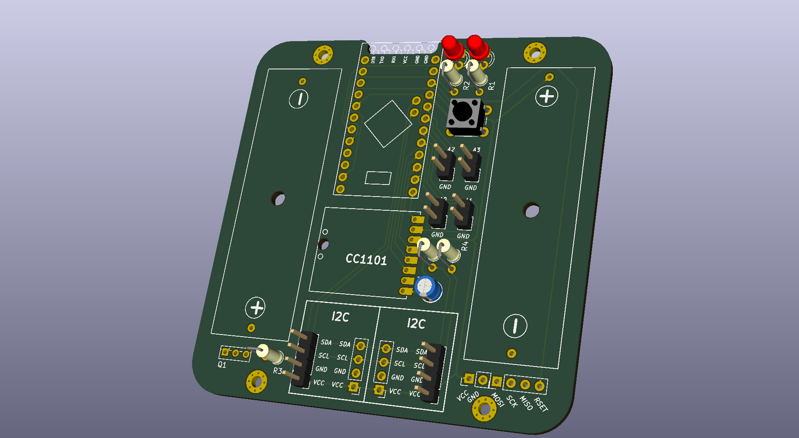
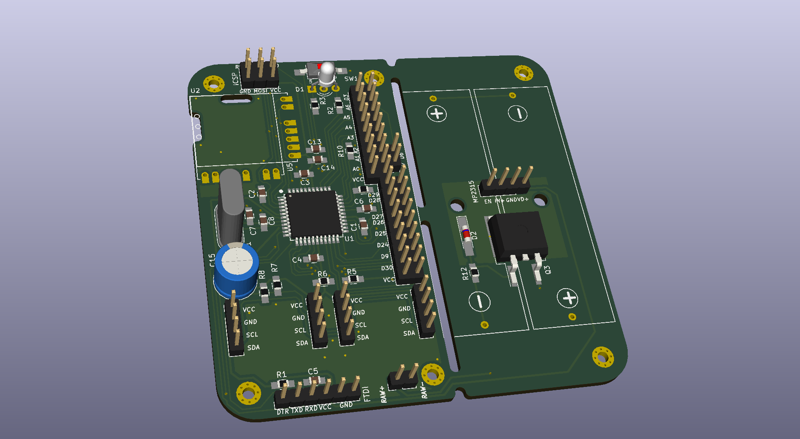

# PCB
## HB-UNI-SEN-BATT
Eine universelle Platine für Homebrew Geräte basierend auf [AskSin++ Library](https://github.com/pa-pa/AskSinPP)

[Schaltplan](HB-UNI-SEN-BATT/HB-UNI-SEN-BATT.pdf)

### Benötigte Bauteile:
* Arduino Pro Mini 3.3V 8Mhz (The Simple)
* CC1101 Modulplatine 868MHz
* 2x LEDs 3mm Low Current (Pin 4 und 5)
* 2x 470Ohm Widerstände (Vorwiderstand für LEDs)
* Elko 100uF 1,5mm
* 2x Goobay Batteriehalter Mignon Print
* Mikroschalter 6*6mm
* Stiftleiste RM 2mm 1x8 Pin (Für CC1101)
* Stiftleiste RM 2,54MM (nach Bedarf)
* IRLU024N (optional für Verpolungsschutz)
* 100KOhm Widerstand (optional für Verpolungsschutz)
* 2x 10KOhm Widerstand (optional Pullup für I2C)

### Passendes Gehäuse
* Camdenboss CBRS01SWH und CBRS01VWH

### Hinweise
* Achtung: Kein Überspannungschutz vorhanden
* Der Verpolungsschutz ist optional. Dafür Bauteil Q1 (IRLU024N) und R3 (100KOhm Widerstand) bestücken. Alternativ J8 auf der Platinenrückseite brücken um ohne Verpolungsschutz zu arbeiten.

## HB-UNI-SEN-PCB
Eine universelle Platine für Homebrew Geräte basierend auf [AskSin++ Library](https://github.com/pa-pa/AskSinPP)

[Schaltplan](HB-UNI-SEN-PCB/HB-UNI-SEN-PCB.pdf)

### Benötigte Bauteile:
* Arduino Pro Mini 3.3V 8Mhz (The Simple)
* CC1101 Modulplatine 868MHz
* 1x LEDs 3mm Low Current (Pin 4)
* 1x 470Ohm Widerstände (Vorwiderstand für LEDs)
* Mikroschalter 6*6mm
* Stiftleiste RM 2mm 1x8 Pin (Für CC1101)
* Stiftleiste RM 2,54MM (nach Bedarf)
* Optional: 2x 10KOhm Widerstand und 2x 10KOhm PTC (Temperaturmessung mit PTC an A0 und A1)

### Hinweise
* Achtung: kein Verpolungs- oder Überspannungschutz vorhanden
* Am I2C sind keine Pullups vorhanden, da diese im Regelfall auf I2C Platinen bereits integriert sind
* Aktuell fehlt noch ein Kondensator am VCC vom CC1101.

## HB-UNI-644
Eine universelle Platine für Homebrew Geräte basierend auf [AskSin++ Library](https://github.com/pa-pa/AskSinPP) und dem ATmega644PA

[Schaltplan](HB-UNI-644/HB-UNI-644.pdf)

### Benötigte Bauteile:
#### Grundfunktion
* ATmega644PA oder ATmega1284P (TQFP44) (U1)
* CC1101 Modulplatine 868MHz ggf. mit RM 2.0 Pinheader (U2)
* 1x Kerko 10uF 0805 (c13)
* 7x Kerko 10nF 0805 (C1-C6, C14)
* 2x Widerstand 330 Ohm 0805 (R2, R3)
* 1x Widerstand 10K Ohm 0805 (R1)
* 1x Triple Color LED Common Cathode THT (D1)
* 1x Tactile Switch 2 Pin 6x3.5 SMD (SW1)
* 1x Quarz 8 Mhz HC49 THT (Y1) (optional)
* 2x Kerko 22pF 0805 (C7, C8) (optional für Quarz)
* Pinheader nach Bedarf

#### Batteriebetrieb mit Step-Up
* 2x Goobay Batteriehalter Mignon Print
* 1x Widerstand 470K Ohm 0805
* 1x Widerstand 100K Ohm 0805
* 1x MAX1724EZK33+T (U3)
* 1x LQH43CN100K03L (L1)
* 1x Kerko 10uF 1206 (C9)
* 1x Kerko 33uF 1206 (C10)

#### Externe Stromversorgung mit 5-24V
* 1x LM3480-3.3
* 1x Kerko 10uF 50V 1206 (C11)
* 1x Kerko 10uF 1206 (C12)

#### Verpolungsschutz (optional, aber sehr empfohlen)
* 1x IRLML6244 (Q1) (Bei Eingangsspannung < 10V)
* 1x IRLML0030 (Q1) (Bei Eingangsspannung > 10V)
* 1x ZMM16V MicroMELF (D2) (Bei Eingangsspannung > 16V)
* 1x Widerstand 100K Ohm 0805 (R4)

#### I2C Pullup Widerstände (optional)
* 2x Widerstand 10k Ohm 0805 (R7, R8)

#### Vorwiderstände für NTC Messung an A0 und A1
* 2x Widerstand 10k Ohm 0805 (R9, R10)

### Passendes Gehäuse
* Camdenboss CBRS01SWH und CBRS01VWH

### Hinweise
* Auch wenn die meisten Bauteile SMD sind, so ist die Platine für Handlötung entwickelt. Dementsprechend sind alle Teile mind. 0805 mit vergrößerten Pads für Handlötung.
* Es kann entweder der Step-up oder der Step-Down bestückt werden, niemals beides zusammen
* Die rechte Seite der Platine kann entfernt werden, wenn die Batteriehalter nicht benötigt werden, es laufen keine Leiterbahnen rechts der Fräsung (abgesehen von denen für die Batterie)
* Falls der Verpolungsschutz nicht verwendet werden soll, dann muss die Lötbrücke J2 geschlossen werden
* Falls eine externe Spannung von 3.3V ohne Spannungsanpassung verwendet werden soll, dann muss die Lötbrücke J4 geschlossen werden
* Die Anschlüsse an J9 sind zusammen mit J12 genau passend für die Platine CJMCU-2803 um an den Anschlüssen ein Darlington Array zu verwenden (Jeder der Ports ist dann mit 500mA belastbar)
* Beschriftung der Anschlüsse folgt dem Bobuino Pinout
